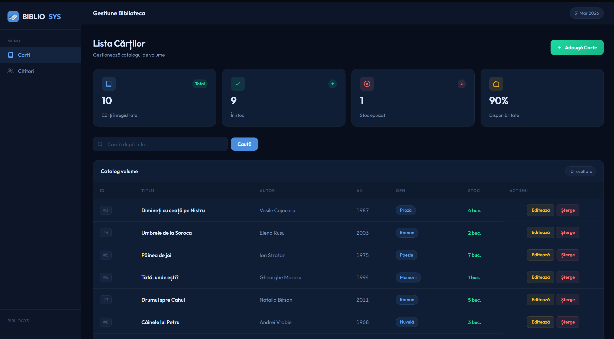
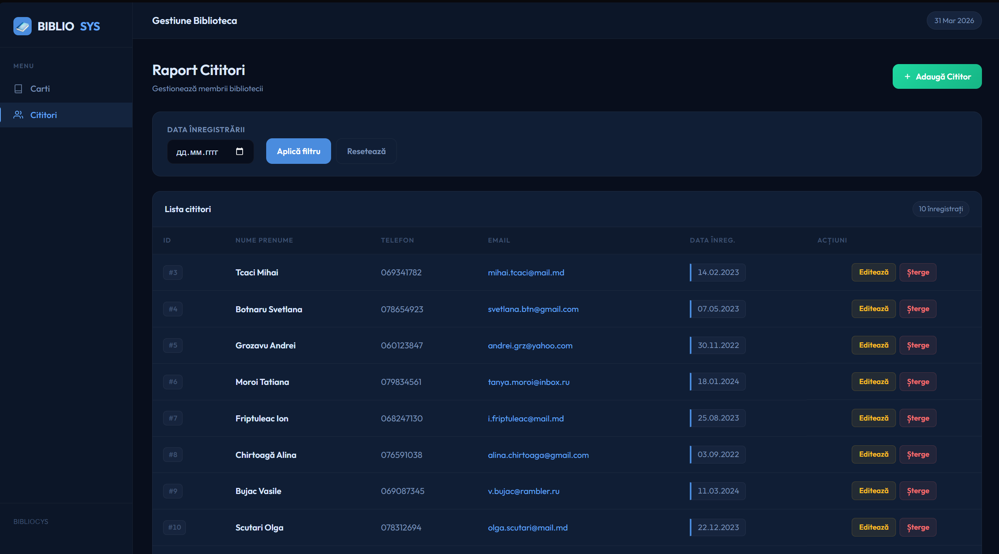

#  BIBLIОСYS — Library Management System

A lightweight, dark-themed web application for managing a library catalog and its registered readers. Built with PHP, MySQL, and vanilla CSS — no frameworks, no dependencies beyond a running LAMP/WAMP stack.

---

## Screenshots

### Books Catalog


### Readers Report


---

## Features

- **Book catalog** — add, edit, delete books with title, author, publication year, genre, and stock quantity
- **Reader management** — register and manage library members with contact details and registration date
- **Live search** — filter books by title in real time
- **Date filter** — filter readers by registration date
- **Stock indicators** — visual in-stock / out-of-stock status per book
- **Dashboard stats** — total books, in-stock count, out-of-stock count, and availability percentage
- **Dark UI** — modern navy dashboard layout with sidebar navigation

---

## Tech Stack

| Layer | Technology |
|-------|-----------|
| Backend | PHP 8+ |
| Database | MySQL / MariaDB |
| Frontend | HTML5, CSS3 (custom, no framework) |
| Font | Outfit (Google Fonts) |
| Server | Apache (XAMPP / WAMP / LAMP) |

---

## Project Structure

```
bibliосys/
├── db.php            # Database connection
├── index.php         # Books list & dashboard stats
├── readers.php       # Readers list with date filter
├── edit_book.php     # Add / edit book form
├── edit_reader.php   # Add / edit reader form
├── delete.php        # Delete handler (books & readers)
└── style.css         # Full dark theme stylesheet
```

---

## Database Setup

### 1. Create the database

```sql
CREATE DATABASE biblioteca_carti
  CHARACTER SET utf8mb4
  COLLATE utf8mb4_unicode_ci;

USE biblioteca_carti;
```

### 2. Create tables

```sql
CREATE TABLE carti (
    ID_carte         INT AUTO_INCREMENT PRIMARY KEY,
    Titlu            VARCHAR(255) NOT NULL,
    Autor            VARCHAR(255) NOT NULL,
    Anul_publicarii  YEAR,
    Gen              VARCHAR(100),
    Cantitate        INT DEFAULT 0
);

CREATE TABLE cititori (
    ID_cititor          INT AUTO_INCREMENT PRIMARY KEY,
    Nume                VARCHAR(100) NOT NULL,
    Prenume             VARCHAR(100) NOT NULL,
    Telefon             VARCHAR(20),
    Email               VARCHAR(150) NOT NULL,
    Data_inregistrarii  DATE
);
```

### 3. Seed sample data

```sql
INSERT INTO carti (Titlu, Autor, Anul_publicarii, Gen, Cantitate) VALUES
('Dimineți cu ceață pe Nistru', 'Vasile Cojocaru', 1987, 'Proză', 4),
('Umbrele de la Soroca',        'Elena Rusu',      2003, 'Roman', 2),
('Pâinea de joi',               'Ion Stratan',     1975, 'Poezie', 7),
('Tată, unde ești?',            'Gheorghe Moraru', 1994, 'Memorii', 1),
('Drumul spre Cahul',           'Natalia Bîrsan',  2011, 'Roman', 5),
('Câinele lui Petru',           'Andrei Vrabie',   1968, 'Nuvelă', 3),
('Toamna fără mere',            'Maria Croitor',   1999, 'Proză scurtă', 0),
('Satul de sub deal',           'Dumitru Lisnic',  1982, 'Roman', 6),
('Scrisori neterminate',        'Veronica Plămădeală', 2007, 'Epistolar', 2),
('Ograda bunicului',            'Petru Harabagiu', 1971, 'Amintiri', 8);

INSERT INTO cititori (Nume, Prenume, Telefon, Email, Data_inregistrarii) VALUES
('Tcaci',       'Mihai',    '069341782', 'mihai.tcaci@mail.md',          '2023-02-14'),
('Botnaru',     'Svetlana', '078654923', 'svetlana.btn@gmail.com',        '2023-05-07'),
('Grozavu',     'Andrei',   '060123847', 'andrei.grz@yahoo.com',          '2022-11-30'),
('Moroi',       'Tatiana',  '079834561', 'tanya.moroi@inbox.ru',          '2024-01-18'),
('Friptuleac',  'Ion',      '068247130', 'i.friptuleac@mail.md',          '2023-08-25'),
('Chirtoagă',   'Alina',    '076591038', 'alina.chirtoaga@gmail.com',     '2022-09-03'),
('Bujac',       'Vasile',   '069087345', 'v.bujac@rambler.ru',            '2024-03-11'),
('Scutari',     'Olga',     '078312694', 'olga.scutari@mail.md',          '2023-12-22'),
('Negară',      'Dmitri',   '060748291', 'dmitri.negara@gmail.com',       '2022-07-16'),
('Rusnac',      'Corina',   '079265813', 'corina.rusnac@yahoo.com',       '2024-02-05');
```

---

## Installation

### Prerequisites
- PHP 8.0 or higher
- MySQL 5.7+ or MariaDB 10.4+
- Apache with `mod_rewrite` enabled (XAMPP / WAMP / LAMP)

### Steps

**1. Clone or download the project**
```bash
git clone https://github.com/Frade11/bibliosys.git
```
or download and extract the ZIP into your web server root (e.g. `htdocs/` for XAMPP).

**2. Configure the database connection**

Open `db.php` and update the credentials if needed:
```php
$host = 'localhost';
$user = 'root';
$pass = '';         
$db   = 'biblioteca_carti';
```

**3. Run the SQL setup**

Import via phpMyAdmin or the MySQL CLI:
```bash
mysql -u root -p < setup.sql
```

**4. Open in browser**
```
http://localhost/bibliosys/index.php
```

---

## Pages Overview

| URL | Description |
|-----|-------------|
| `index.php` | Books dashboard — stats cards + searchable catalog table |
| `readers.php` | Readers report — filterable by registration date |
| `edit_book.php` | Add new book or edit existing one |
| `edit_reader.php` | Register new reader or edit existing one |
| `delete.php?type=book&id=N` | Delete a book by ID |
| `delete.php?type=reader&id=N` | Delete a reader by ID |

---

## Security Notes

This project is intended for **local / intranet use**. Before deploying to a public server:

- Add authentication (login page + session management)
- Enable HTTPS
- Move `db.php` outside the web root or protect it with `.htaccess`
- Consider using prepared statements everywhere (already in place) and add CSRF tokens to forms

---

## License

MIT — free to use, modify, and distribute.
